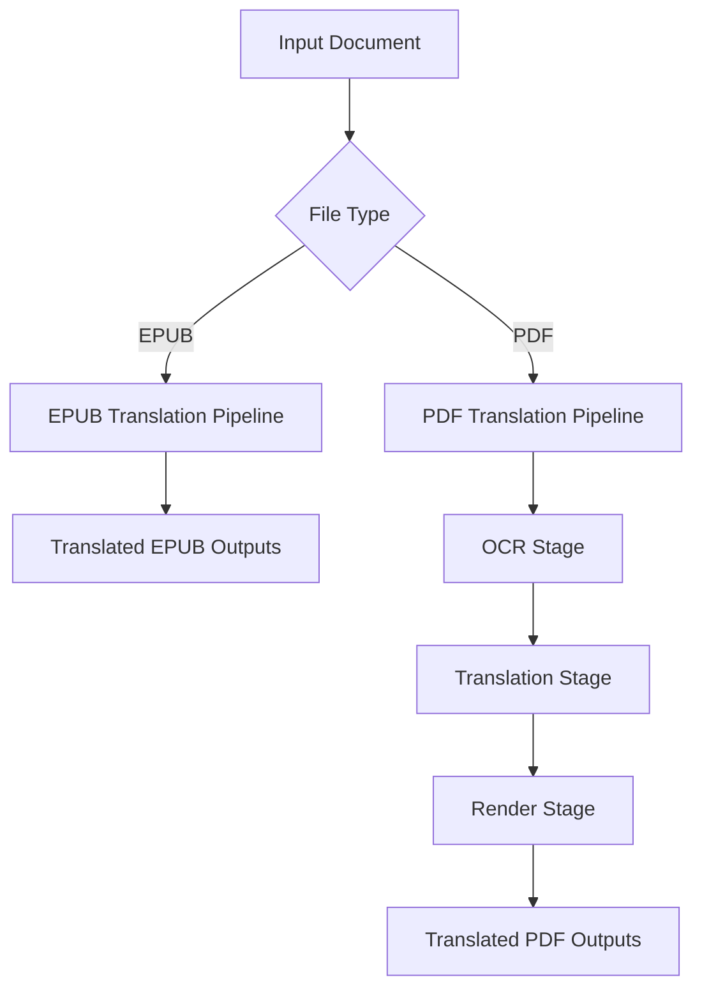
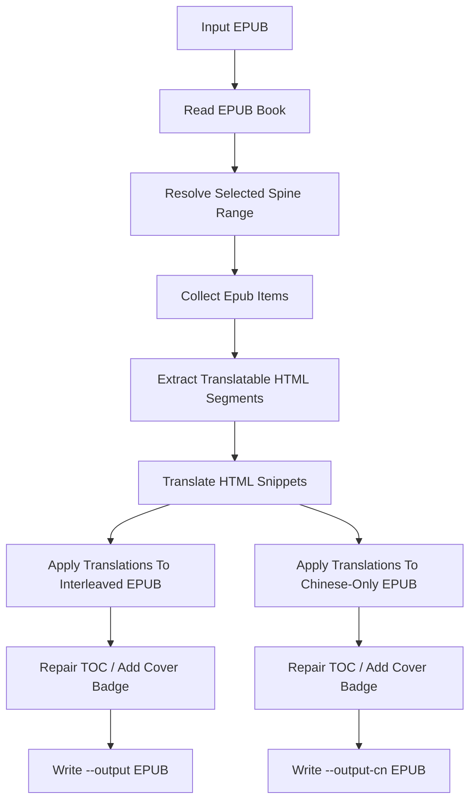
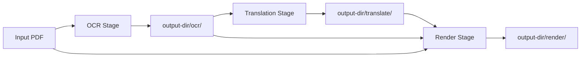
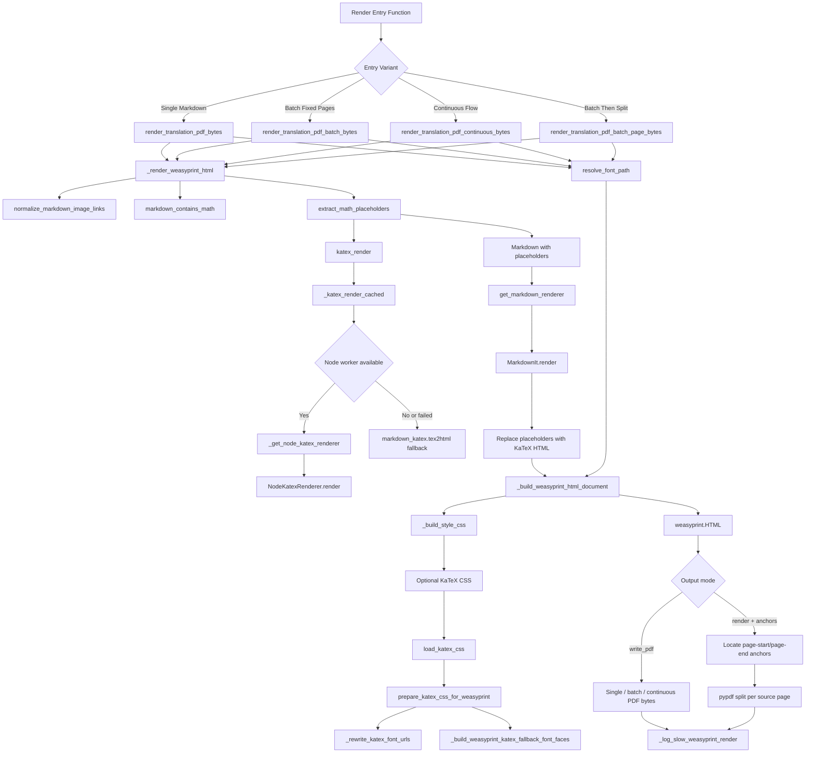

# Translation Pipeline Design

本文档描述当前仓库中两条实际存在的翻译流程：

- EPUB translation: [`src/translate/epub_translate.py`](/home/wonder/dev/pdftranslate/src/translate/epub_translate.py)
- PDF translation: [`src/translate/pdf_translate.py`](/home/wonder/dev/pdftranslate/src/translate/pdf_translate.py)

两条流程共用翻译服务模块 [`src/translate/translate_service.py`](/home/wonder/dev/pdftranslate/src/translate/translate_service.py)，但输入介质、中间产物和最终输出不同，因此本文分开说明。

## 总体划分

## EPUB Translation

### 入口与目标

入口文件：

- [`src/translate/epub_translate.py`](/home/wonder/dev/pdftranslate/src/translate/epub_translate.py)

目标：

- 读取输入 EPUB。
- 从 spine 中抽取可翻译的 block 元素。
- 逐段翻译 HTML 内容。
- 生成交织版 EPUB。
- 可选生成中文版 EPUB。

### 主要模块

- [`src/translate/epub_translate.py`](/home/wonder/dev/pdftranslate/src/translate/epub_translate.py)
- [`src/translate/translate_service.py`](/home/wonder/dev/pdftranslate/src/translate/translate_service.py)
- [`src/translate/add_cover_badge.py`](/home/wonder/dev/pdftranslate/src/translate/add_cover_badge.py)

### 流程

### 输入

必需输入：

- `--input`: 原始 EPUB 文件。
- 翻译服务配置：
  - `--translation-base-url`
  - `--translation-api-key`
  - `--translation-model`

可选输入：

- `--spine-range`: 只翻译部分 spine 文档。
- `--output-cn`: 额外输出中文版 EPUB。
- `--overwrite`: 允许覆盖已有输出文件。

### 输出

必需输出：

- `--output`: 交织版 EPUB，译文块插在原文块前面。

可选输出：

- `--output-cn`: 中文版 EPUB。

### 中间数据

EPUB 流程没有像 PDF 那样把中间阶段产物持久化到单独目录。它的主要中间数据都在内存中：

- 选中的 spine item 列表。
- 每个文档解析后的 `BeautifulSoup` 树。
- 提取出的 `HtmlSegment` 列表。
- 模型返回的翻译结果列表。

### 当前设计特点

- EPUB 翻译是“结构内翻译”，目标是保留原始 HTML 结构。
- 元数据中的 title / description 也会被翻译。
- 交织版和中文版共用同一批翻译结果，只是在回写模式上不同。
- 目录会在输出前做一次修复，避免不合法的 TOC 条目导致 EPUB 不可读。

## PDF Translation

### 入口与目标

入口文件：

- [`src/translate/pdf_translate.py`](/home/wonder/dev/pdftranslate/src/translate/pdf_translate.py)

目标：

1. 把输入 PDF 转成逐页 OCR Markdown。
2. 把 OCR Markdown 翻译成中文 Markdown。
3. 把译文 Markdown 渲染成 PDF。
4. 可选生成“译文页 + 原始 PDF 页”的交织版 PDF。

### 三阶段定义

PDF translation 明确分成三个阶段：

1. OCR stage
2. Translation stage
3. Render stage

阶段之间通过文件系统衔接，每个阶段都可以消费前一阶段已经落盘的产物。

### 输出目录约定

对于输入文件 `book.pdf`，目标设计下 `--output-dir` 应包含三个阶段目录：

- `ocr/`
- `translate/`
- `render/`

其中各阶段目录约定如下：

- `ocr/ocr_raw/`
- `ocr/images/`
- `ocr/page_XXXX.md`
- `ocr/book_original.md`
- `ocr/book_ocr.json`

- `translate/images/`
- `translate/page_XXXX_cn.md`
- `translate/book_cn.md`

- `render/book_original.pdf`
- `render/book_cn.pdf`
- `render/book_interleaved.pdf`

下面按阶段说明这些文件分别由谁生产、由谁消费。

## PDF Stage 1: OCR

### 目标

- 读取原始 PDF。
- 选择要处理的页码。
- 将每页栅格化成图像。
- 调用 OCR 服务得到逐页 Markdown。
- 处理图片裁剪、OCR 清洗和跨页段落边界合并。
- 产出可供 translation stage 直接消费的原文 Markdown 文件与页级文件。
- 所有下游只依赖 `ocr/` 目录中的文件，不依赖 OCR 阶段的内存数据结构。

### 主要模块

- [`src/translate/pdf_translate.py`](/home/wonder/dev/pdftranslate/src/translate/pdf_translate.py)
- [`src/translate/ocr_markdown.py`](/home/wonder/dev/pdftranslate/src/translate/ocr_markdown.py)
- [`src/translate/ocr_client.py`](/home/wonder/dev/pdftranslate/src/translate/ocr_client.py)
- [`src/translate/ocr_client_deepseek.py`](/home/wonder/dev/pdftranslate/src/translate/ocr_client_deepseek.py)
- [`src/translate/ocr_deepseek_postprocess.py`](/home/wonder/dev/pdftranslate/src/translate/ocr_deepseek_postprocess.py)
- [`src/translate/ocr_pdf_images.py`](/home/wonder/dev/pdftranslate/src/translate/ocr_pdf_images.py)
- [`src/translate/translate_page_merge.py`](/home/wonder/dev/pdftranslate/src/translate/translate_page_merge.py)

### 输入文件

OCR stage 需要的文件输入：

- `--input`: 原始 PDF 文件。

OCR stage 会使用但不属于文件输入的运行参数：

- `--pages`
- `--ocr-base-url`
- `--ocr-api-key`
- `--ocr-model`
- `--ocr-prompt`
- `--ocr-dpi`
- `--ocr-workers`

### 运行时中间数据

OCR stage 在内存中会构造这些中间数据：

- 选中的 `page_numbers`
- 每页的 PIL 图像对象
- 每页 OCR 原始文本
- 每页 merge 前的 Markdown
- 跨页段落边界合并决策

### 输出文件

OCR stage 的核心输出文件：

- `ocr/<base>_ocr.json`
  - 内容：页码元数据。
  - 用途：主要用于调试、恢复和校验。下游阶段不应把它作为硬依赖输入。
- `ocr/<base>_original.md`
  - 内容：完成跨页合并后的整份原文 Markdown，按固定分页分隔符串接。
  - 用途：translation stage 的主输入。
- `ocr/page_XXXX.md`
  - 内容：每一页最终原文 Markdown，已经包含跨页 merge 后的结果。
  - 用途：用于阶段恢复、局部补跑和按页翻译。

OCR stage 还会输出辅助文件：

- `ocr/images/*`
  - 内容：从 PDF 页面中裁剪出的图片资源。
  - 用途：translation stage 会拷贝到 `translate/images/`，render stage 最终消费的是译文目录中的图片。
- `ocr/ocr_raw/page_XXXX.md`
  - 内容：原始 OCR 文本，可能包含 grounded/layout 标记。

### 增量执行与跳过逻辑

OCR stage 不要求“缺一个文件就整阶段重跑”，而是采用两层补齐逻辑：

1. 页级补齐
   - 如果某页缺失 `ocr/ocr_raw/page_XXXX.md`，则只补跑这一页的 OCR 原始产物。
   - 如果某页缺失 `ocr/page_XXXX.md`，则在拥有完整页级原料后重新生成该页最终 Markdown。
2. 聚合文件重建
   - 如果所有目标页的 `ocr/page_XXXX.md` 都存在，但 `ocr/<base>_original.md` 缺失，则只从页文件重建总 Markdown。

由于 `ocr/page_XXXX.md` 表示 merge 后结果，OCR 阶段在补齐页文件时必须基于完整页集合重新执行跨页 merge，再写回最终页文件和总文件。

## PDF Stage 2: Translation

### 目标

- 读取 OCR stage 落盘后的原文 Markdown 与页文件。
- 初始化翻译服务。
- 逐页翻译 Markdown。
- 将 `ocr/images/` 拷贝到 `translate/images/`。
- 生成整份译文 Markdown 文件与页级译文文件。

## WeasyPrint Render Flow

### 模块职责

[`src/translate/render_weasyprint.py`](/home/wonder/src/DeepSeek-OCR/src/translate/render_weasyprint.py) 负责把翻译后的 Markdown 变成最终 PDF。它内部包含四层职责：

- Markdown 预处理：规范图片路径，识别数学公式。
- KaTeX 渲染：把 LaTeX 公式转成可嵌入 HTML 的 KaTeX 片段。
- HTML 与 CSS 组装：拼接页面片段、字体、页尺寸和 KaTeX 样式。
- WeasyPrint 输出：生成整份 PDF，或者按页切分成多个 PDF 字节串。

### 调用流程图

### 入口函数差异

- `render_translation_pdf_bytes`
  - 输入是一段 Markdown。
  - 输出是一个 PDF。
  - 适合“整段译文渲染成单个文档”。
- `render_translation_pdf_batch_bytes`
  - 输入是多页 Markdown。
  - 每页外面包一个 `translated-page` section，按原页边界强制分页。
  - 输出是一个包含多页的 PDF。
- `render_translation_pdf_continuous_bytes`
  - 输入也是多页 Markdown。
  - 但不保留原页边界，而是把内容连起来让 WeasyPrint 自然分页。
- `render_translation_pdf_batch_page_bytes`
  - 先批量渲染若干页。
  - 再借助 HTML 锚点和 `pypdf` 找出每个原始页落在 PDF 的哪些页上。
  - 最终返回“原始页索引 -> 单页 PDF 字节串”的映射列表。

### 关键设计点

- 公式不会直接交给 Markdown 解析，而是先由 `extract_math_placeholders` 替换成占位符，再在 HTML 阶段回填，避免公式语法被 Markdown 误处理。
- KaTeX 渲染优先走常驻 Node worker，减少频繁启动子进程的成本；失败时再回退到 `markdown_katex`。
- KaTeX CSS 会在渲染前重写字体路径，并在字体不完整时注入系统字体别名，目的是让 WeasyPrint 在本地环境里也能正确排公式。
- `render_translation_pdf_batch_page_bytes` 通过“小批量合并渲染，再按锚点切分”的方式平衡吞吐量和单页输出需求。

### 主要模块

- [`src/translate/pdf_translate.py`](/home/wonder/dev/pdftranslate/src/translate/pdf_translate.py)
- [`src/translate/translate_service.py`](/home/wonder/dev/pdftranslate/src/translate/translate_service.py)

### 输入文件

Translation stage 依赖这些文件输入：

- `ocr/<base>_original.md`
  - 来源：OCR stage。
  - 作用：整份原文 Markdown 主输入。
- `ocr/page_XXXX.md`
  - 来源：OCR stage。
  - 作用：按页翻译，以及在总文件缺失时重建总译文。
- `ocr/images/*`
  - 来源：OCR stage。
  - 作用：拷贝到 `translate/images/`，使译文目录自洽。

Translation stage 会使用但不属于文件输入的运行参数：

- `--translation-base-url`
- `--translation-api-key`
- `--translation-model`
- `--translation-temperature`
- `--translation-workers`
- `--translation-max-chunk-chars`
- `--translation-system-prompt`
- `--skip-first-page-translation`
- `--no-translation`

### 输出文件

Translation stage 的核心输出文件：

- `translate/<base>_cn.md`
  - 内容：整份译文 Markdown，按固定分页分隔符串接。
  - 用途：render stage 的主输入。
- `translate/page_XXXX_cn.md`
  - 内容：每一页对应的译文 Markdown。
  - 用途：阶段恢复和局部重跑。
- `translate/images/*`
  - 内容：从 `ocr/images/` 拷贝过来的图片资源。
  - 用途：使 `translate/` 目录可以独立作为 render stage 输入。

### 增量执行与跳过逻辑

Translation stage 也采用“按页补缺 + 总文件重建”的策略：

1. 图片补齐
   - `translate/images/` 不完整时，只补拷贝缺失图片，不重拷已存在文件。
2. 页级翻译补齐
   - 如果 `translate/page_XXXX_cn.md` 已存在，则跳过该页翻译。
   - 仅翻译缺失页。
3. 聚合文件重建
   - 当所有目标页的 `translate/page_XXXX_cn.md` 都存在后，若 `translate/<base>_cn.md` 缺失，则只重建总文件。
   - 如果新增或重写了任何页级译文，也应重新拼接总文件，保证与页文件一致。

## PDF Stage 3: Render

### 目标

- 读取 OCR stage 和 translation stage 落盘后的文件。
- 按页尺寸和图片资源把译文渲染成 PDF。
- 渲染原文 Markdown 对应的原文 PDF。
- 输出纯译文 PDF。
- 可选输出交织版 PDF。

### 主要模块

- [`src/translate/pdf_translate.py`](/home/wonder/dev/pdftranslate/src/translate/pdf_translate.py)
- [`src/translate/render_pandoc.py`](/home/wonder/dev/pdftranslate/src/translate/render_pandoc.py)
- [`src/translate/render_weasyprint.py`](/home/wonder/dev/pdftranslate/src/translate/render_weasyprint.py)
- [`src/translate/render_runner.py`](/home/wonder/src/DeepSeek-OCR/src/translate/render_runner.py)

### 输入文件

Render stage 依赖这些文件输入：

- `ocr/<base>_original.md`
  - 来源：OCR stage。
  - 作用：生成原文 PDF。
- `translate/<base>_cn.md`
  - 来源：translation stage。
  - 作用：中文版 PDF 的主内容输入。
- `translate/page_XXXX_cn.md`
  - 来源：translation stage。
  - 作用：生成 interleaved PDF 时使用逐页译文。
- `translate/images/*`
  - 来源：translation stage。
  - 作用：渲染 Markdown 中引用的图片。
- `--input` 指向的原始 PDF
  - 来源：初始输入文件。
  - 作用：读取原始页尺寸，且在生成交织版 PDF 时直接取原始 PDF 页对象。

Render stage 会使用但不属于文件输入的运行参数：

- `--render-engine`
- `--generate-interleave-pdf`
- `--font-path`
- `--font-size`：最终正文字号，建议使用带单位的长度值，如 `10.5pt`
- `--page-width`
- `--min-page-height`
- `--margin`
- `--image-spacing`
- `--layout-workers`
- `--katex-css-path`

### 输出文件

Render stage 的输出文件：

- `render/<base>_original.pdf`
  - 内容：由 `ocr/<base>_original.md` 渲染出的原文 PDF。
- `render/<base>_cn.pdf`
  - 内容：由 `translate/<base>_cn.md` 渲染出的中文版 PDF。
- `render/<base>_interleaved.pdf`
  - 内容：交织版 PDF，按“译文页 -> 原始 PDF 页”顺序交替排布。
  - 仅在启用 `--generate-interleave-pdf` 时生成。

### 增量执行与跳过逻辑

Render stage 的三个 PDF 输出彼此独立：

- 如果 `render/<base>_original.pdf` 已存在，则跳过原文 PDF 渲染。
- 如果 `render/<base>_cn.pdf` 已存在，则跳过中文版 PDF 渲染。
- 如果启用了 `--generate-interleave-pdf` 且 `render/<base>_interleaved.pdf` 已存在，则跳过交织版渲染。

不要求因为缺一个 render 输出就重跑整个 render stage。

## PDF 分阶段文件关系总表

| 阶段 | 必需输入文件 | 核心输出文件 | 辅助输出文件 |
| --- | --- | --- | --- |
| OCR | `--input` 指向的原始 PDF | `ocr/<base>_original.md`、`ocr/page_XXXX.md` | `ocr/<base>_ocr.json`、`ocr/images/*`、`ocr/ocr_raw/page_XXXX.md` |
| Translation | `ocr/<base>_original.md`、`ocr/page_XXXX.md`、`ocr/images/*` | `translate/<base>_cn.md`、`translate/page_XXXX_cn.md` | `translate/images/*` |
| Render | `ocr/<base>_original.md`、`translate/<base>_cn.md`、`translate/page_XXXX_cn.md`、`translate/images/*`、原始 PDF | `render/<base>_original.pdf`、`render/<base>_cn.pdf` | `render/<base>_interleaved.pdf` |

## 推荐阅读顺序

如果要修改 EPUB translation，建议先看：

1. [`src/translate/epub_translate.py`](/home/wonder/dev/pdftranslate/src/translate/epub_translate.py)
2. [`src/translate/translate_service.py`](/home/wonder/dev/pdftranslate/src/translate/translate_service.py)
3. [`src/translate/add_cover_badge.py`](/home/wonder/dev/pdftranslate/src/translate/add_cover_badge.py)

如果要修改 PDF translation，建议按阶段阅读：

1. [`src/translate/pdf_translate.py`](/home/wonder/dev/pdftranslate/src/translate/pdf_translate.py)
2. [`src/translate/ocr_markdown.py`](/home/wonder/dev/pdftranslate/src/translate/ocr_markdown.py)
3. [`src/translate/ocr_client_deepseek.py`](/home/wonder/dev/pdftranslate/src/translate/ocr_client_deepseek.py)
4. [`src/translate/ocr_deepseek_postprocess.py`](/home/wonder/dev/pdftranslate/src/translate/ocr_deepseek_postprocess.py)
4. [`src/translate/translate_page_merge.py`](/home/wonder/dev/pdftranslate/src/translate/translate_page_merge.py)
5. [`src/translate/translate_service.py`](/home/wonder/dev/pdftranslate/src/translate/translate_service.py)
6. [`src/translate/render_pandoc.py`](/home/wonder/dev/pdftranslate/src/translate/render_pandoc.py)
7. [`src/translate/render_weasyprint.py`](/home/wonder/dev/pdftranslate/src/translate/render_weasyprint.py)
8. [`src/translate/render_runner.py`](/home/wonder/src/DeepSeek-OCR/src/translate/render_runner.py)
